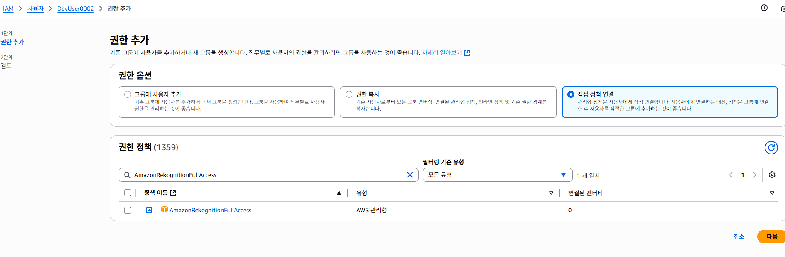
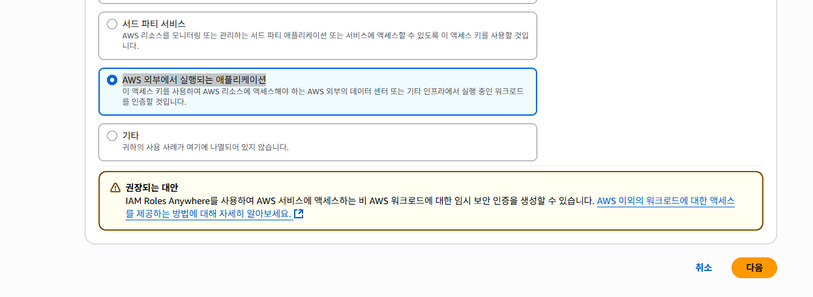
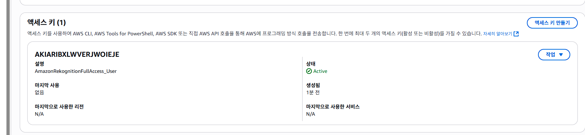

## 학습자료 공유 드립니다.
## 6월16일 자료 동영상 입니다. Google TTS - mp3 에 Python Capture 만들어서 mp4 + mp3 병합한 파일 입니다.

## Email List
 zenki1025@naver.com
 charlie7428@naver.com
 ksminfor23@gmail.com
 pipie314@protonmail.com
 ky000612@gmail.com
 tb0415266@gmail.com
 suhyeoko2@gmail.com

## 수업 주 내용은 AWS AI 서비스 중 Chapter 2 ~ 3 입니다. 해당 수업을 위한 AWS 리소스는 아래와 같습니다.
## 6월23일 ~ 24일 강의 리소스 목록과 그 내용 중 교재 연결 페이지 입니다.
## IAM - AWS 인프라구축가이드 중 127페이지
## 클라우드워치 - 190페이지
## AWS CLI, SDK - 312페이지
## 레코그니션, S3, API GW, Lamda, 클라우드포메이션 은 교재에 없으므로 총 3개의 Git 을 공유하여 수업합니다.

## 교재에 IAM 관련 부분이 미약하여, 추가로 올려 드립니다.
## 교재 예제를 단계별로 풀어나가기 위해 일단, AWS Rekognition을 사용하여 Node.js에서 이미지에서 텍스트를 추출하는 예제를 실습합니다.

## 전제 조건
## 1. AWS 계정 + IAM 사용자(권한: AmazonRekognitionFullAccess)

## 2. **외부 애플리케이션(서버/웹앱)**에서 AWS API를 호출하기 위해
## Node.js, Python, Java 등으로 개발된 서버 애플리케이션에서
## 예: S3에서 이미지 업로드
## 예: Rekognition으로 이미지 분석
## AWS 외부에서 실행되므로 인증을 위해 Access Key가 필요
## 일반적으로 IAM 사용자에 정책을 부여하고 키 발급해서 사용

## Access key ID,Secret access key 는 각자 유출되지 않도록 주의 보관 요망

## 위와 같이 Access Key 가 있어야 합니다.

## npm init -y
## 위의 결과로 package.json 이 생성 됩니다.

## 3. AWS SDK 설치
## npm install aws-sdk
## 위의 결과로 node_modules 가 생성 됩니다.

## node extract.js
## 결과예시
<!-- [1] ) (신뢰도: 46.14%)
[2] DevUser0002 (신뢰도: 97.75%)
[3] i (신뢰도: 93.56%)
[4] IAM (신뢰도: 98.67%)
[5] 1 (신뢰도: 93.72%)
[6] ЛН HOL . (신뢰도: 64.75%)
[7] 2014 (신뢰도: 32.07%) -->

## https://awscli.amazonaws.com/AWSCLIV2.msi

