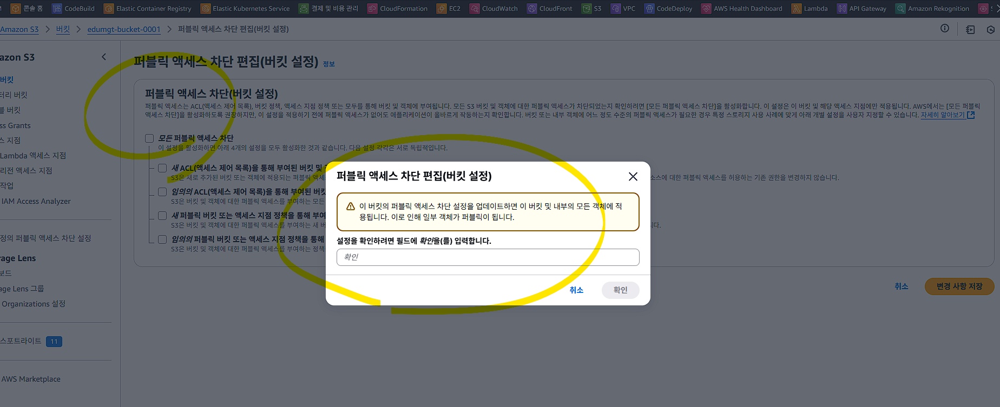
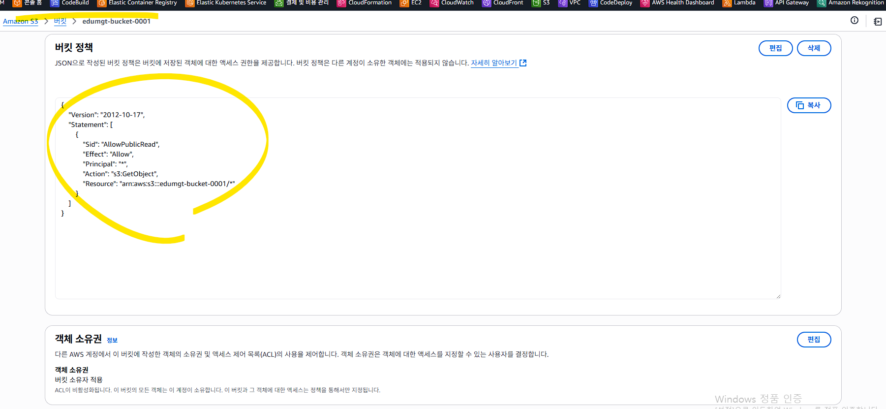

## 퍼블릭 액세스 권한 부여

## 버킷 정책(Bucket Policy)이 퍼블릭을 허용하는지 확인 
## aws s3api put-bucket-policy --bucket edumgt-bucket-0001 --policy file://bucket.json

## 결과

## 이미지 URL 노출
https://edumgt-bucket-0001.s3.ap-northeast-2.amazonaws.com/face1.png

가능

## 그외 체크 포인트
1. 퍼블릭 액세스 차단 정책 확인
S3 콘솔 → 버킷 선택 → 권한 → 퍼블릭 액세스 차단 설정

✅ "퍼블릭 액세스 차단"이 모두 꺼져 있어야 퍼블릭 사용자가 접근할 수 있습니다:

✔️ [ ] 새 ACL로 부여된 퍼블릭 액세스를 차단
✔️ [ ] 모든 퍼블릭 액세스 차단
🔁 aws cli 명령어로도 확인 가능:

aws s3api get-bucket-policy-status --bucket my-bucket-name
✅ 2. **버킷 정책(Bucket Policy)**이 퍼블릭을 허용하는지 확인
예시 (정적 웹사이트 호스팅 또는 이미지 공개에 사용):

{
  "Version": "2012-10-17",
  "Statement": [
    {
      "Sid": "AllowPublicRead",
      "Effect": "Allow",
      "Principal": "*",
      "Action": "s3:GetObject",
      "Resource": "arn:aws:s3:::my-bucket-name/*"
    }
  ]
}
적용:

aws s3api put-bucket-policy --bucket my-bucket-name --policy file://policy.json
✅ 3. 버킷 객체(Object)에 퍼블릭 권한이 부여되었는가
객체 단위로도 s3:GetObject 권한이 필요합니다

aws s3 cp로 업로드할 때 --acl public-read 옵션이 없다면 퍼블릭이 못 봅니다

aws s3 cp file.jpg s3://my-bucket-name/ --acl public-read
확인:

aws s3api get-object-acl --bucket my-bucket-name --key file.jpg
✅ 4. 올바른 URL로 접근 중인가
S3 객체에 접근하려면 URL은 아래 형식입니다:

https://my-bucket-name.s3.amazonaws.com/image.jpg
또는 리전 포함:

https://my-bucket-name.s3.ap-northeast-2.amazonaws.com/image.jpg
💡 경로가 403 AccessDenied를 반환한다면 오탈자, 확장자, 경로 오류일 가능성도 있습니다.

✅ 5. AWS Organizations or SCP 정책에서 제한되었는지 확인
만약 조직 계정 사용 중이라면, **Service Control Policy(SCP)**나 IAM 정책이 S3 퍼블릭 액세스를 막고 있을 수 있습니다.

🧪 진단 요약 명령어

# 버킷의 퍼블릭 정책 확인
aws s3api get-bucket-policy-status --bucket my-bucket-name

# ACL 확인
aws s3api get-bucket-acl --bucket my-bucket-name
aws s3api get-object-acl --bucket my-bucket-name --key your-file.jpg